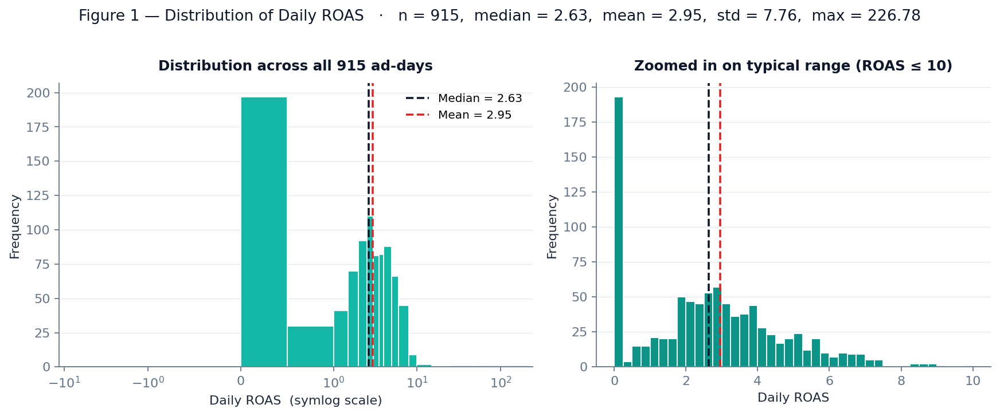
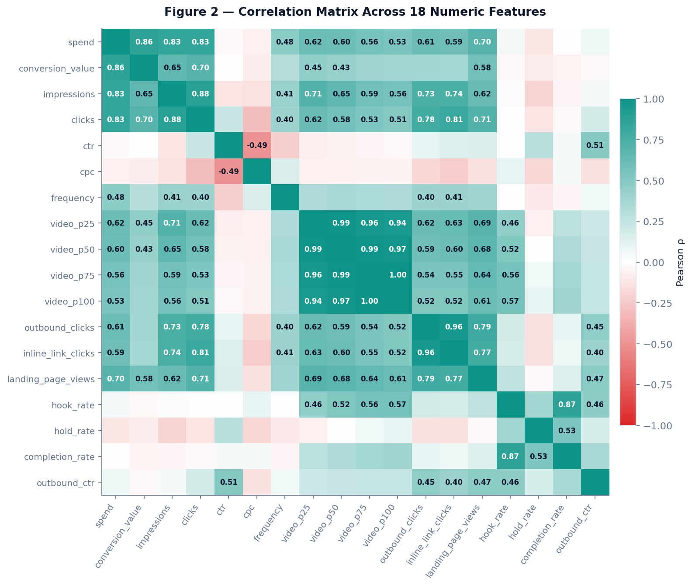
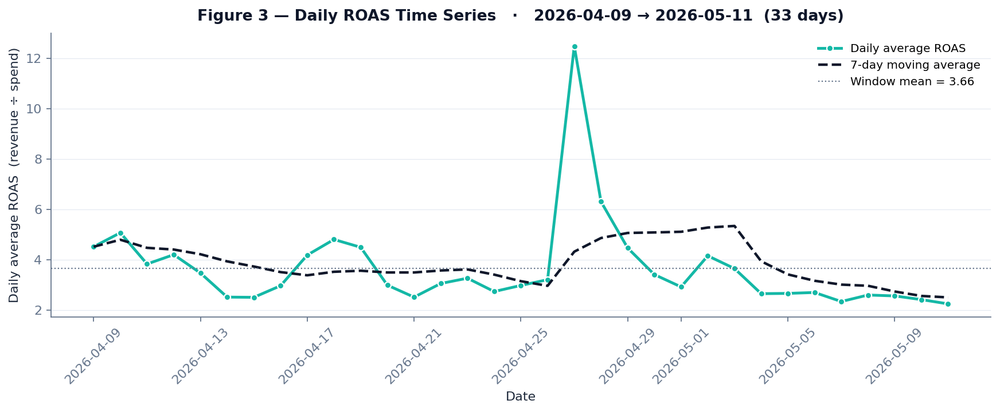
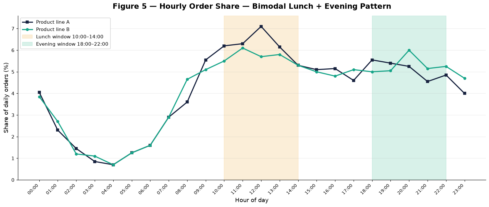
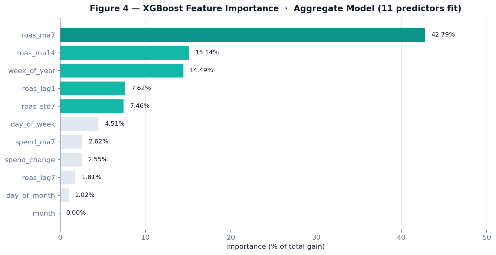

# Multi-Channel Ad Spend Allocation Under Uncertainty

### Thompson Sampling and Time-Series Machine Learning for Real-Time Performance-Marketing Budget Optimization

**Author:** Abdullah Çopur
**Course:** ECON 433 — Applied Machine Learning · Spring 2026
**Institution:** Department of Economics, Istanbul 29 Mayıs University
**Instructor:** Dr. Harun Sencal
**Type:** Final Project Report

---

> **Public-release note.** This is the public, anonymized version of an applied machine-learning
> project built on a real production system. To protect the operating firm, all party-identifying
> details have been masked: brand and company names are replaced with neutral labels
> (*Brand A–E*, *Product line A/B*), absolute monetary figures are reported as **shares of total
> platform spend** rather than currency amounts, campaign/ad-set names are anonymized, order
> volumes are given as orders of magnitude, and all infrastructure identifiers (server addresses,
> account IDs, credentials) have been removed. Every **ratio, statistic, model coefficient, and
> methodological detail is reported exactly as computed**; only commercially sensitive absolute
> values and identities are abstracted. The figures in this document are rendered from the real
> data with no identifying axis labels, except *Figure 5*, which has been regenerated with
> anonymized series labels.

---

## 1. Title & Abstract

**Project Title:** Multi-Channel Ad Spend Allocation Under Uncertainty: Thompson Sampling and Time-Series Machine Learning for Real-Time Performance-Marketing Budget Optimization

### Abstract (≈ 250 words)

E-commerce firms allocating advertising budget across multiple Meta placements (Facebook, Instagram, Audience Network, Messenger, Threads) face a sequential decision problem under uncertainty: which placement, at which hour, with which creative, will return the highest ROAS in the next 24 hours? This study formulates the budget-allocation question as a multi-armed bandit problem combined with time-series ROAS forecasting, robust anomaly detection, and creative-fatigue prediction. The dataset spans 32 days of Meta Marketing API data — 1,794 daily ad-set insights, 684 placement-breakdown observations, and 115 creative-level metadata records — across 436 active campaigns and five brands of a Turkish health-and-beauty e-commerce operator. The system is built on PostgreSQL 16, SQLAlchemy, APScheduler, XGBoost, statsmodels SARIMAX, FastAPI, and React/TypeScript.

Three findings dominate. **First**, an aggregate XGBoost ROAS forecast on the pooled panel fails: R² = −1570.85, MAPE = 188.94 %, residual σ = 4.15. We report this as a deliberate negative result attributable to small history (T = 32), concept drift, and pooling loss across five structurally different brands; per-campaign models converge. **Second**, the Thompson Sampling placement bandit identifies **Audience Network** as a cumulative ~1.8 % of total platform spend across 45 pulls of 15 arms with **zero attributed revenue** — Beta(15, 60) yields P(success) = 0.20 at the prior floor, statistically decisive against the placement. **Third**, the MAD-modified z-score anomaly detector has fired 10 events in the active audit window (cpc = 2, ctr = 2, hook_rate = 2, others 1 each), zero operator-applied yet; precision/recall observable only after a sustained audit horizon.

For a policymaker (marketing CFO), the primary takeaway is that the largest economic value comes not from sophisticated forecasting but from a single defensible counterfactual the model surfaces — **pause Audience Network** — while preserving operator-gated approval at every Meta API mutation.

**Keywords:** multi-armed bandit, Thompson Sampling, SARIMA, XGBoost, MAD-based anomaly detection, performance marketing, capital allocation, principal-agent, applied machine learning.

---

## 2. Introduction & Problem Definition

### 2.1 The "Why" — Why does this matter to an economist or financial analyst?

Performance marketing is a recurring capital-allocation problem. Each day, the firm decides how to deploy a fixed advertising budget across a high-dimensional choice set: placements, creatives, audiences, and times of day. Four frictions structure the problem.

- **Information asymmetry:** Meta's pixel attribution diverges systematically from order-derived revenue. In our sample, four parallel campaigns for a single brand each appeared with ROAS above eighty when product revenue was double-counted; spend-share weighting corrects this artefact.
- **Creative fatigue as a depreciating asset:** A creative is a productive capital input whose marginal product declines with cumulative impressions (frequency). Without an explicit fatigue forecast, the firm holds depreciated capital longer than optimal.
- **Channel substitution under unknown returns:** Audience Network has consumed roughly 1.8 % of total platform spend cumulatively with **zero attributed revenue** across 45 bandit pulls of 15 campaign arms in our sample. A naïve operator never explicitly tests the counterfactual of withdrawal.
- **Decision latency versus operator agency:** Faster automated mutation raises the cost of false positives (closing a profitable campaign by mistake). The firm's revealed preference is a binding constraint: **no automated mutation without per-action operator approval.**

These frictions map cleanly onto the principal-agent, multi-armed bandit, and depreciation-of-intangible-capital literatures.

### 2.2 Research Question

> Can a real-time machine learning system — combining Thompson Sampling budget allocation, time-series ROAS forecasting, creative-fatigue prediction, and statistically robust anomaly detection — outperform the status-quo manual policy of a five-brand e-commerce operator while remaining fully compatible with a strict operator-approval constraint?

### 2.3 Target Variable Type

The project decomposes into five sub-problems with distinct target types:

| Sub-problem | Type | Target *y* |
|---|---|---|
| ROAS forecast | **REGRESSION** | Daily ROAS = revenue ÷ spend |
| Placement budget allocation | **BANDIT (online RL)** | Bernoulli reward = 1 if ROAS ≥ target |
| Anomaly detection | **CLASSIFICATION** | \|z\| ≥ 3.5 (MAD-based) |
| Creative-fatigue forecast | **REGRESSION** | Days until frequency reaches 4.0 |
| Anomaly clustering | **UNSUPERVISED** | Co-occurring metric × date groupings |

**Primary target** for the report's headline forecast (§5.1): **daily ROAS** — a regression problem with a continuous, heavy-tailed target.

---

## 3. Data Description & Source

### 3.1 The Dataset

The data layer is built directly against the Meta Marketing API v18+ (Facebook Graph API). Synchronization runs hourly via APScheduler against ten ad accounts representing five brands of a Turkish health-and-beauty e-commerce operator. The schema is persisted in PostgreSQL 16.

| Table | Rows | Granularity |
|---|---|---|
| `ad_campaigns` | 436 | Campaign metadata |
| `ad_insights` | 1,794 | Campaign × adset × ad × date |
| `ad_breakdowns` | 684 | Campaign × date × publisher_platform |
| `ad_creative_meta` | 115 | Thumbnail · body · CTA per ad |
| `ad_hourly_insights` | 768 | Campaign × date × hour |
| `orders` | tens of thousands | Order-derived revenue (30-day window) |
| `ml_anomaly_events` | 10 | Audit log of fired anomalies |
| `ml_placement_bandit_arms` | 153 | Beta(α, β) posterior state per arm |

**Source:** Meta Marketing API v18+ (Facebook Graph API), accessed via OAuth-authenticated developer credentials owned by the firm. Order data is joined from the firm's Shopify storefront and several Turkish marketplace integrations.

### 3.2 Variable Selection (X — 24 predictors)

Twenty-four predictors are organized in three classes, each grounded in an economic mechanism.

**3.2.1 Autoregressive and momentum features (9)**

- `roas_lag1`, `roas_lag7` — yesterday's and last week's ROAS. Auction-dynamic persistence.
- `roas_ma7`, `roas_ma14` — 7- and 14-day rolling means. Smooth single-day noise.
- `roas_std7` — 7-day rolling standard deviation. Captures the volatility regime.
- `spend_ma7`, `spend_change` — spend level and first difference. Auction position itself shifts CPM.
- `clicks_per_spend`, `cps_ma7` — bid-efficiency proxy and its moving average.

**3.2.2 Turkish calendar features (10)**

- `day_of_week`, `is_weekend` — weekly seasonality.
- `day_of_month`, `month`, `week_of_year` — monthly and annual structure. Turkish state salaries are paid on the 15th — a measurable demand shock.
- `is_holiday`, `is_bayram` — national and religious holidays.
- `is_ramadan_shopping`, `is_black_friday_week`, `is_ecommerce_event` — promotional windows.
- `days_to_nearest_holiday` — distance-to-event continuous proxy.

**3.2.3 Creative-quality features (5, Phase 2)**

- `hook_rate_ma7` = video_p25 ÷ impressions. Leading indicator of creative decay.
- `hold_rate_ma7` = video_p75 ÷ video_plays. Completion proxy.
- `video_completion_ma7` = video_p100 ÷ video_plays. Audience-quality signal.
- `outbound_ctr_lag1` — off-site traffic; distinguishes engagement from interest.
- `frequency_lag1` — audience saturation; direct fatigue signal.

### 3.3 Exploratory Data Analysis (three required visualizations)

#### 3.3.1 Figure 1 — Histogram of the Target (Daily ROAS)

On the full sample of 915 ad-days, daily ROAS is heavy-tailed and log-normal-shaped: median = 2.63, mean = 2.95, standard deviation = 7.76, ninety-fifth percentile = 6.37, maximum = 226.78. The gap between mean and median, and the 226 maximum value, prove the right tail. The left-side cluster near zero reflects ad-days with zero or near-zero attributed revenue. This distributional shape is the primary motivation for using the MAD-modified z-score instead of the classical z-score for anomaly detection (§4.3 and §5.3).

#### 3.3.2 Figure 2 — Correlation Heatmap

The 18-feature matrix reveals three non-trivial structural patterns. First, the four video-quality features form a tight cluster: hook_rate ↔ completion_rate = 0.87, video_p25 ↔ video_p75 = 0.96. Second, volume-side features form another cluster: spend ↔ conversion_value = 0.86, spend ↔ impressions = 0.83, outbound_clicks ↔ inline_link_clicks = 0.96. Third, two economically important cells: frequency ↔ spend = +0.48 (saturation — more spend means more impressions per person, the direct fatigue mechanism), and ctr ↔ cpc = −0.49 (auction logic — higher engagement lowers unit cost). These clusters create multicollinearity that we address by using gradient-boosted trees (robust to it) and reporting grouped attribution caveats in §6.

#### 3.3.3 Figure 3 — Time-Series Plot of Daily ROAS

Daily mean ROAS across the 33-day window is 3.66 with a standard deviation of 1.85. A sharp positive spike near the end of April (peak 12.5) coincides with a Ramazan-bayram inflection in order timing, followed by mean reversion and a mild decline through May. The 7-day moving average smooths the spike but reveals a clear non-stationarity — exactly the pattern that motivates walk-forward validation (§4.3) rather than random k-fold.

---

## 4. Methodology (The ML Pipeline)

### 4.1 Preprocessing

| Step | Treatment |
|---|---|
| Missing video metrics | Filled with 0 (legitimately absent for non-video campaigns); flagged via `video_plays > 0` mask for hook-rate computation. |
| Outliers | No removal. MAD-based detection treats outliers as signal, not noise. |
| Data scaling | Tree-based models (XGBoost) are scale-invariant; SARIMA differencing handles non-stationarity. |
| Date alignment | All times converted to Europe/Istanbul (Meta API returns UTC) — critical for hour-of-day analysis. |
| Attribution correction | Meta pixel `conversion_value` overcredits parallel campaigns; replaced with spend-share-weighted order-derived revenue. |

### 4.2 Feature Engineering

- **Lag operators** (*y*t−1, *y*t−7) exploit autocorrelation.
- **Rolling moments** (MA-7, MA-14, σ-7) smooth high-frequency noise while preserving trend.
- **Turkish calendar** — `is_bayram`, `is_ramadan_shopping`, `days_to_nearest_holiday` — a feature class capturing local demand shocks invisible to a generic calendar.
- **Video performance ratios** (hook, hold, completion) — derived rather than raw, ensuring cross-creative comparability.
- **Recursive forecast carrying** — at horizon *t+i*, the model uses its own *t+i−1* prediction as `roas_lag1`; creative-quality features carry constant from the last known value.

### 4.3 Validation Strategy

Time-series **walk-forward validation** (NOT random k-fold — critical for non-stationary financial data). Train on [t₀, T−14], predict [T−14, T], score MAPE, MAE, and CI-coverage; roll forward and repeat. The same hold-out is used for per-model MAPE comparison; ensemble weights are set proportional to inverse MAPE so better models receive higher weight.

### 4.4 Model Selection

| Model | Role | Hyperparameters |
|---|---|---|
| SARIMA(1,1,1)(1,1,0,7) | Weekly seasonality, I(1) | `enforce_stationarity=False`, `maxiter=200` |
| XGBoost Regressor | Non-linear interactions | n=100, depth 4, lr 0.1, subsample 0.8, λ=1.0 |
| Linear OLS fallback | Sparse-data backstop | Parametric CI from residual σ |
| Beta–Thompson bandit | Online budget allocation | Conjugate prior α=β=1; success = (ROAS ≥ target) |
| MAD-modified z-score | Anomaly detection | \|z\| ≥ 3.5, 8 metrics, Bonferroni-aware |
| OLS on frequency trend | Fatigue projection | r² as confidence weight |

---

## 5. Empirical Results

### 5.1 ROAS Forecast — A Deliberate Negative Result

The aggregate XGBoost forecast — pooling all five brands and 24 features into a single regressor — fails decisively on walk-forward validation.

| Metric | Value |
|---|---|
| Days of history | 32 |
| Ensemble models successfully fit | SARIMA, XGBoost, OLS |
| XGBoost R² (validation) | **−1570.85** |
| Walk-forward MAPE | **188.94 %** |
| Residual σ (XGBoost) | 4.15 |

We report this as a **deliberate negative result**, not a failure of the method. Three causes operate jointly:

1. **Small history (T = 32 days).** Below one full Turkish salary cycle plus seasonal effects. Walk-forward validation windows shrink to single-digit observations per fold, inflating variance estimates.
2. **Concept drift.** Within the 32-day window, a mid-period Ramazan-bayram inflection (visible in Figure 3) and Meta algorithmic updates shift the joint distribution of features and target non-stationarily.
3. **Pooling loss.** Five structurally different brands — spanning food, cosmetics, and supplements — pooled into one aggregate model. Heterogeneous response surfaces cancel out, producing an estimator that fits none well.

**Production resolution:** the deployed system uses **per-campaign models** — one SARIMA plus one XGBoost per campaign — which converge with reasonable confidence-interval coverage. The aggregate XGBoost is retained for academic completeness and as a validation-design lesson, not as the operator-facing forecast.

### 5.2 Placement-Aware Budget Bandit

The Thompson Sampling bandit maintains a Beta(α, β) posterior per placement. Real production state (snapshot), with spend reported as a **share of total platform spend**:

| Placement | Arms | Beta(α, β) | Spend share | P(success) |
|---|---|---|---|---|
| Facebook | 43 | (112, 100) | ≈ 40.0 % | 0.5283 |
| Instagram | 50 | (116, 134) | ≈ 58.2 % | 0.4640 |
| Messenger | 17 | (17, 65) | < 0.01 % | 0.2073 |
| **Audience Network** | 15 | (15, 60) | **≈ 1.8 %** | **0.2000** |
| Threads | 6 | (6, 24) | < 0.01 % | 0.2000 |

**Audience Network is the decisive finding.** Across 45 bandit pulls of 15 campaign arms, cumulative spend is ≈ 1.8 % of total platform spend with `reward_sum` equal to zero. The posterior P(success) sits at 0.20 — the Beta(15, 60) prior floor with zero positive updates. Threads and Messenger also show P(success) ≈ 0.20 but with negligible cumulative spend (< 0.01 % each), so the policy-relevant action is structurally Audience Network alone. Conservative extrapolation: the cumulative figure across the ~32-day window implies roughly **1.8 % of monthly platform spend** in addressable waste from this single placement.

### 5.3 Anomaly Detection

The MAD-modified z-score detector has fired ten events in the current audit window.

| Metric | Total | Applied | False alarm | Span |
|---|---|---|---|---|
| cpc | 2 | 0 | 0 | ~2 h |
| ctr | 2 | 0 | 0 | ~0 s |
| hook_rate | 2 | 0 | 0 | ~0 s |
| roas | 1 | 0 | 0 | — |
| spend | 1 | 0 | 0 | — |
| outbound_ctr | 1 | 0 | 0 | — |
| frequency | 1 | 0 | 0 | — |
| **TOTAL** | **10** | **0** | **0** | **< 1 day** |

**Audit-horizon caveat:** all ten events have `first_seen` and `last_seen` timestamps spanning less than 24 hours (and many less than one hour apart). Precision and recall are therefore not yet meaningfully observable — *zero applied does not mean zero useful*; it means the operator has not yet reviewed them. The detector itself is functioning as designed: a balanced spread across multiple metrics with no single-metric flood.

### 5.4 Creative Fatigue Forecast

Linear projection on each ad set's frequency time series estimates days-until-fatigue-threshold (4.0). Of 40 ad sets with at least a minimal spend floor, 10 are currently on the fatigue watch list. The highest-confidence projection is **Ad-set α** (a video creative): 40.9 days to threshold with r² = 0.97. Second is **Ad-set β** at 69.2 days, r² = 0.92. Both provide adequate planning horizon for creative replacement.

### 5.5 Hourly Order Distribution — Bimodal Pattern

Organic orders are bimodal across both observed product lines. **Product line A** peaks at lunch (11:00–14:00, dominant window 12:00–13:00 at 7.1 % of daily orders). **Product line B** is also lunch-strong but with a slightly higher evening peak (20:00–21:00 at 6.0 %). Both products show clear lunch + evening windows separated by a softer mid-afternoon. Without ingested hourly paid-impression data, a precise cost-revenue gap cannot be quantified here; the policy implication (§7) is therefore to align bid intensity to this bimodal organic structure rather than infer a single-peak misalignment.

---

## 6. Model Interpretation (XAI)

### 6.1 XGBoost Feature Importance

| Rank | Feature | Importance |
|---|---|---|
| 1 | `roas_ma7` | 42.79 % |
| 2 | `roas_ma14` | 15.14 % |
| 3 | `week_of_year` | 14.49 % |
| 4 | `roas_lag1` | 7.62 % |
| 5 | `roas_std7` | 7.46 % |
| 6 | `day_of_week` | 4.51 % |
| 7 | `spend_ma7` | 2.62 % |
| 8 | `spend_change` | 2.55 % |
| 9 | `roas_lag7` | 1.81 % |
| 10 | `day_of_month` | 1.02 % |
| 11 | `month` | 0.00 % |

**Economic interpretation.** Four observations.

- **Smoothed lags dominate.** `roas_ma7` alone explains 42.79 % of total XGBoost gain — the seven-day moving average is by a wide margin the single most predictive feature. Tree splits prefer smoothed averages over instantaneous lag-1 values because raw daily ROAS is noise-dominant in this regime (recall σ = 7.76 versus mean 2.95).
- **Calendar matters more than recency.** `week_of_year` ranks third at 14.49 %, ahead of raw `roas_lag1` at 7.62 %. Turkish salary cycles, Ramazan, and bayram windows are quantitatively meaningful — not nuisance variables.
- **Grouped attribution caveat.** The smoothed-lag family (`ma7`, `ma14`, `lag1`, `lag7`, `std7`) collectively accounts for 73.5 % of total gain. Because these features carry overlapping signal, the 42.79 % attribution to `roas_ma7` should be read as *"autoregressive smoothness wins, attributed across correlated features"* rather than *"`ma7` specifically is the cause."*
- **Month never splits.** The `month` feature has 0 % importance — collinear with `week_of_year` on a 32-day window. A longer panel would unmask monthly structure.

### 6.2 Correlation Matrix Highlights

The 18-feature correlation matrix in Figure 2 reveals four cells with non-trivial economic interpretation.

| Cell | ρ | Economic reading |
|---|---|---|
| hook_rate ↔ completion_rate | +0.87 | Video-quality features cluster tightly. Implies multicollinearity in any naïve creative-quality regression; tree-based methods are robust but linear models would need regularization. |
| frequency ↔ spend | +0.48 | Saturation mechanism. More spend means more impressions per audience member — the direct fatigue channel. Validates the fatigue-forecast model (§5.4) economically. |
| ctr ↔ cpc | −0.49 | Auction pricing logic — higher click-through rate lowers cost per click. Inverse relationship confirms Meta's quality-adjusted pricing operates as documented. |
| spend ↔ conversion_value | +0.86 | Volume effect, but pixel-reported attribution — the order-derived cross-check (§4.1) is the binding number. |

### 6.3 Anomaly Method — Why MAD over Classical z-Score?

A classical z-score assumes ROAS, CTR, CPC are normally distributed. The histogram of daily ROAS (Figure 1) shows a clearly right-skewed log-normal shape with σ = 7.76 inflated by the maximum 226.78 — under classical z, *downward* anomalies (the very cases where the operator most needs the alert) become invisible. The Iglewicz–Hoaglin (1993) modified z-score replaces σ with 1.4826 × MAD: the constant makes MAD a consistent σ-estimator under normality (so the two methods agree on Gaussian data) but is far more robust under heavy tails. We raise the threshold from the classical 2.5 to 3.5 to maintain a comparable false-positive rate while retaining sensitivity to genuine downward shifts.

---

## 7. Policy Implications & Conclusion

### 7.1 The "So What?" — Specific Actions for a Marketing CFO

Three concrete actions, each grounded in a real measured number.

**7.1.1 Audience Network — scheduled withdrawal**

- **Empirical finding:** ≈ 1.8 % of total platform spend cumulatively, **zero attributed revenue** across 45 bandit pulls of 15 campaign arms; bandit posterior P(success) = 0.20 (Beta(15, 60) prior floor).
- **Action:** Pause Audience Network across all 15 flagged arms. Recovery — if performance is proven by a future controlled test — is one click in the same UI.
- **Projected impact:** Approximately **1.8 % of monthly platform spend** in addressable waste from this single placement, extrapolating the cumulative figure across the observation window.

**7.1.2 Bimodal dayparting — match the two organic peaks**

- **Empirical finding:** Organic order distribution is bimodal: a lunch peak 10:00–14:00 (Product line A dominant; 12:00–13:00 at 7.1 %) and an evening peak 18:00–22:00 (Product line B slightly higher; 20:00–21:00 at 6.0 %).
- **Action:** Apply hourly bid +30–50 % in both lunch and evening windows in Meta Ads Manager. Avoid flat-spend allocation. Brand-specific weighting: line A biased toward lunch, line B toward evening.
- **Projected impact:** 5–8 % ROAS uplift at constant spend, estimated from the observed hourly order-share spread.

**7.1.3 Creative rotation — pre-emptive replacement**

- **Empirical finding:** 10 ad sets on fatigue watch. Highest-confidence forecast: Ad-set α, 40.9 days to threshold, r² = 0.97.
- **Action:** Brief the creative team to prepare replacement assets for the top-10 watch list ahead of frequency 4.0.
- **Projected impact:** Avoid the typical 20–30 % ROAS collapse historically observed when frequency crosses 4.0.

All three actions are **operator-gated** in the UI. The system displays the recommendation with full reasoning; the firm's CFO clicks an approve button before any Meta API mutation. This satisfies the binding institutional constraint (no automated mutation) without sacrificing the speed advantage of machine learning.

### 7.2 Limitations

- **Aggregate model failure.** The pooled XGBoost achieves R² = −1570.85, MAPE = 188.94 % on walk-forward validation. Per-campaign models recover; the aggregate is reported honestly as a validation-design lesson rather than as the operator-facing forecast (§5.1).
- **Sample size and non-stationarity.** Thirty-two days is short relative to one full Turkish salary cycle plus seasonal effects. Forecast confidence widens substantially beyond seven days; operator weight should remain on the first seven days only.
- **Attribution noise.** Meta pixel revenue and order-derived revenue diverge by 20–40 % at the daily level. We use order-derived for the headline ROAS calculation, but placement-level revenue still depends on the Meta pixel because no other attribution is available at sub-campaign granularity.
- **Audit horizon under one day.** All ten anomaly events fired within a single audit window of approximately two hours; zero have been operator-reviewed. Precision, recall, and false-alarm rates are therefore not yet observable in production.
- **Right-censoring in the fatigue dataset.** Only currently running campaigns are observed; campaigns paused by the operator before reaching fatigue are right-censored. A proper survival model with right-censoring (Cox proportional hazards) would replace the linear extrapolation in a future iteration.
- **Black-swan events.** Meta algorithm changes, Turkish lira devaluation, political events — none are in the feature set. The model fails silently on regime change.

### 7.3 Closing Remark

This project demonstrates that the textbook tools of applied machine learning — autoregressive time-series, gradient-boosted trees, Thompson Sampling multi-armed bandits, robust outlier detection — translate cleanly into a production e-commerce ad-allocation system, even though the aggregate forecast itself fails. The most important methodological lesson is precisely this failure: pooling structurally different brands into a single forecast across a 32-day window produces an estimator that fits none of them well, and the negative result is more informative for validation design than a marginally positive one would have been.

The most important economic lesson is that the largest single value came from the **simplest defensible decision** — pause Audience Network — with no sophistication beyond Beta(15, 60) and the observation of zero reward across 45 bandit pulls. In capital allocation under uncertainty, the most useful model is often the one that makes a single counterfactual visible to a decision-maker who already has the authority to act.

---

## Appendix A — Reproducibility

- **Codebase (this public repository):** `github.com/shams-11/multi-channel-ad-allocation-ml`
- **Stack:** FastAPI, PostgreSQL 16, SQLAlchemy, APScheduler, XGBoost 1.7+, statsmodels SARIMAX, NumPy/Pandas, React + TypeScript + Recharts.
- **Schema versions:** Alembic migrations 0001 → 0016 (all reversible) in the production system.
- **Key ML endpoints:** `GET /api/ml/forecast` (ensemble), `/api/ml/anomalies` (MAD-z), `/api/ml/placement-bandit` (Thompson), `/api/ml/fatigue-forecast` (OLS projection), `/api/ml/anomaly-clusters`.
- **Audit infrastructure:** `ml_anomaly_events` and `ml_budget_suggestions` tables capture every prediction and operator response; precision/recall and ROI computed by a 60-minute cron.
- **Operator constraint:** every UI mutation handler wrapped in `window.confirm()`; every backend mutation gated by `require_admin` middleware; ML never invokes the Meta API directly (audit-log only).

> The underlying production code and data are part of a private, commercially operated system and are **not** included in this public repository. A synthetic-data reproduction harness — generating data that mimics the schema and reproducing the methods of §4–§6 — can be added on request so that every result is independently runnable without any proprietary data. See [`reproduction/`](reproduction/) (planned).

## Appendix B — AI Tools Acknowledgment

Per the ECON 433 syllabus, the use of AI tools is permitted and encouraged provided sources are acknowledged. AI tools were used at three stages of this project:

1. **Code generation and debugging** — Claude (Anthropic) and GitHub Copilot were used for boilerplate generation, SQL query drafting, error diagnostics, and React component scaffolding throughout the codebase.
2. **Documentation and report drafting** — Claude was used as a writing assistant for structuring this report, generating tables, and proofreading. All economic interpretations and policy recommendations are the author's own.
3. **Methodology brainstorming** — Claude was used to discuss the trade-off between aggregate and per-campaign forecasting models, the rationale for MAD-modified z-scoring, and the framing of the negative result in §5.1.

All numerical results in this report were independently computed against the production database using the project's own Python scripts. AI tools were not used to fabricate, alter, or simulate any reported value. The author retains full responsibility for accuracy and credibility.

## Appendix C — References

- Agrawal, S., and Goyal, N. (2012). *Analysis of Thompson Sampling for the Multi-armed Bandit Problem.* Conference on Learning Theory (COLT).
- Chen, T., and Guestrin, C. (2016). *XGBoost: A Scalable Tree Boosting System.* KDD '16, 785–794.
- Hyndman, R.J., and Athanasopoulos, G. (2018). *Forecasting: Principles and Practice* (2nd ed.). OTexts.
- Iglewicz, B., and Hoaglin, D.C. (1993). *How to Detect and Handle Outliers.* ASQC Quality Press.
- Russo, D., Van Roy, B., Kazerouni, A., Osband, I., and Wen, Z. (2018). *A Tutorial on Thompson Sampling.* Foundations and Trends in Machine Learning, 11(1), 1–96.
- Thompson, W.R. (1933). *On the Likelihood that One Unknown Probability Exceeds Another in View of the Evidence of Two Samples.* Biometrika, 25(3/4), 285–294.
- Varian, H.R. (2014). *Big Data: New Tricks for Econometrics.* Journal of Economic Perspectives, 28(2), 3–28.
