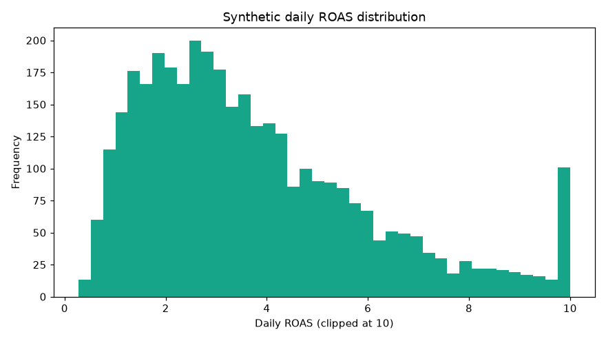
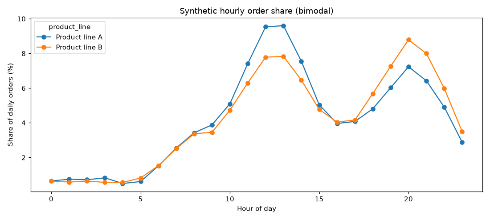
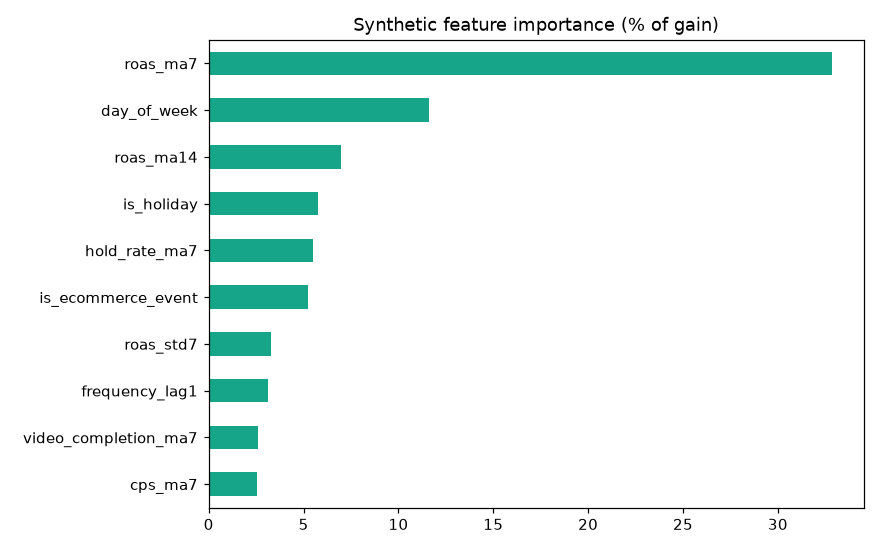

# Reproduction harness (synthetic data)

A self-contained, **synthetic-data** reproduction of the methods in
[`../REPORT.md`](../REPORT.md). It contains **no production code and no real
data** — a seeded generator fabricates a dataset that mimics the production
schema, and the four documented methods run against it. Every number it prints
is illustrative.

## Run it

```bash
pip install -r requirements.txt
# from the repository root:
python -m reproduction.run_all
```

It prints a console report and writes figures to `reproduction/outputs/`. A
committed copy of those figures (from a default `seed=433` run) lives in
[`sample_outputs/`](sample_outputs/) so you can see the result without running anything:

| Synthetic ROAS distribution | Hourly order share | Feature importance |
|---|---|---|
|  |  |  |

All three are generated from **synthetic** data and are titled accordingly — they
illustrate the *shape* of each result (heavy-tailed ROAS, bimodal orders,
autoregression-dominated importance), not the firm's real figures.

## Sample data

A committed, synthetic dataset (default `seed = 433`) lives in
[`sample_data/`](sample_data/) — `ad_panel.csv`, `placement_observations.csv`,
`hourly_orders.csv`. It mimics the production schema (REPORT.md §3.1) so the
methods run on concrete files, and contains **no real production data**.

## What it reproduces

| Module | Report section | What it shows |
|---|---|---|
| `synthetic_data.py` | §3 | Generates a campaign×date panel with heavy-tailed ROAS, a bayram inflection, a zero-revenue Audience Network placement, rising ad-set frequency, and bimodal hourly orders. |
| `features.py` | §3.2, §4.2 | Builds the autoregressive, Turkish-calendar, and creative-quality predictors. |
| `forecasting.py` | §4.3, §5.1 | The aggregate (pooled) booster **fails**; per-campaign SARIMA converges — the deliberate negative result. |
| `bandit.py` | §5.2 | Beta-Bernoulli Thompson Sampling flags the zero-reward placement (P(success) at the prior floor). |
| `anomaly.py` | §5.3 | MAD-modified z-score detector (\|z\| ≥ 3.5). |
| `fatigue.py` | §5.4 | OLS frequency projection to the 4.0 saturation threshold. |

## Tests

```bash
pip install pytest
pytest reproduction/tests -q
```

The tests assert the report's behavioural claims on synthetic data: the bandit
isolates the zero-reward placement, the MAD detector fires on injected outliers,
every documented feature is produced, the `BetaArm` posterior is immutable, and
the fatigue projection behaves on a rising series.

> **Note.** `forecasting.py` uses XGBoost when installed and falls back to a
> scikit-learn gradient booster otherwise, so the harness runs even where an
> XGBoost wheel is unavailable. Results are illustrative regardless.
